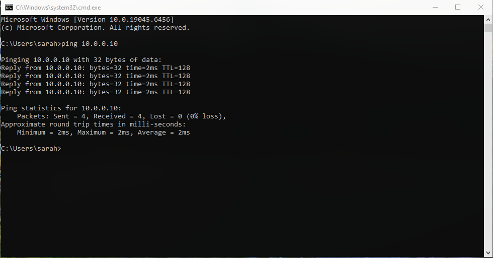
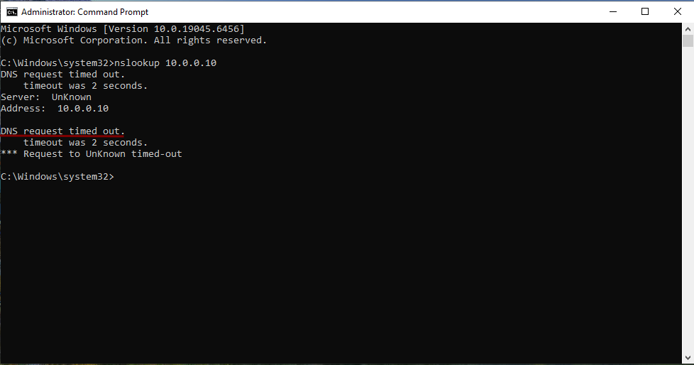
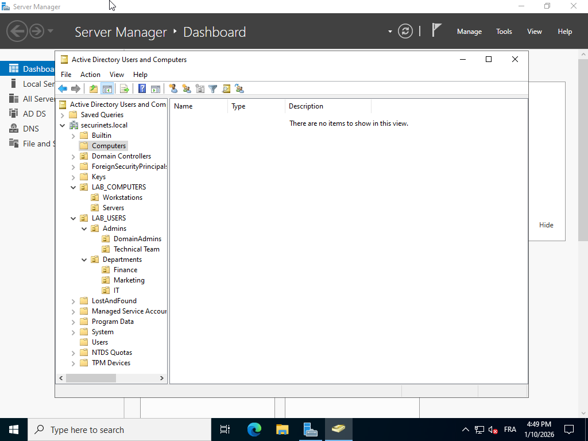
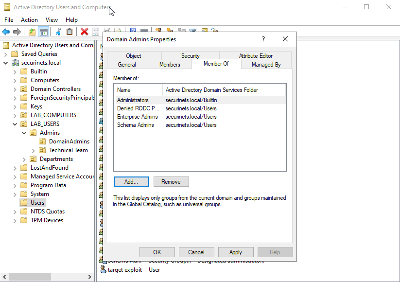

# Rapport

# **Security Operation Center Project**

### Project Overview: Secure Corporate Infrastructure Lab

**Introduction**
In the current cybersecurity landscape, the "Defense in Depth" strategy is the gold standard for protecting organizational assets. This project involves the design, deployment, and hardening of a virtualized corporate network environment (`CYBERLAB.LOCAL`). The goal is to simulate a realistic small-to-medium enterprise (SME) infrastructure to test and validate security policies, network segmentation, and system hardening techniques.

**Project Objectives**
The primary objective is to move beyond simple connectivity and implement a "Secure by Design" architecture. The project is divided into three critical phases:

- **Phase 1: Infrastructure Deployment:** Establishing the Active Directory backbone, DNS services, and client workstations for distinct departments (IT, Finance, Marketing).
- **Phase 2: System Hardening (GPO):** Implementing granular Group Policy Objects to restrict access, enforce AppLocker rules, audit privilege escalation, and manage browser security.
- **Phase 3: Network Security (OPNsense):** Deploying a perimeter firewall to manage traffic flow, enforce proxy settings, and isolate the internal network from external threats.

**Scope of Work**
This lab demonstrates the practical application of Windows Server administration and network security principles. It focuses on the balance between **usability** for employees (allowing Marketing to browse, IT to script) and **security** for the organization (blocking unauthorized software, auditing admin actions).

**Technology Stack**

- **Hypervisor:** VMware Workstation / VirtualBox
- **Server OS:** Windows Server 2019/2022 (Domain Controller)
- **Client OS:** Windows 10 Enterprise
- **Network Security:** OPNsense Firewall & Proxy
- **Management:** Active Directory (AD DS), Group Policy Management (GPMC), PowerShell

## **Phase 1 : Setup and connectivity**

**Primary Goal :** Establish a functional, isolated, and resilient virtualized Active Directory infrastructure that serves as the foundation for future Security Operations Center (SOC) simulation and monitoring.

### **Architectural Design Decisions :**

1. Hypervisor Selection: QEMU/KVM :QEMU/KVM was selected because it leverages Kernel-based Virtual Machine (KVM) technology to achieve Type 1 (bare-metal) performance characteristics. By transforming the Linux kernel itself into a hypervisor, it allows VMs to bypass the traditional Operating System translation layer required by Type 2 hypervisors (like VMware Workstation). This direct hardware access significantly reduces overhead, resulting in lower latency and near-native execution speeds.
2. Network Topology :The infrastructure utilizes a **Host-Only (Private) Network** architecture. All virtual machines are connected to a centralized virtual switch (vSwitch) operating on the `10.0.0.0/24` subnet. This design creates a "Sandbox" environment—a completely isolated ecosystem where network traffic can be generated, monitored, and analyzed without interfering with the host machine or the external public internet.

### **Implementation details :**

**Machines:**

| **Machine Name** | **Role** | **OS** | **RAM** | **IP Address** |
| --- | --- | --- | --- | --- |
| **DC01** | Domain Controller | Windows Server 2022 | 4GB | 10.0.0.10 |
| **WIN10-CLIENT01** | Endpoint Client | Windows 10 Enterprise | 6GB | 10.0.0.20 |
- **Server DNS (127.0.0.1):** The Domain Controller (`DC01`) was configured with a loop-back address (`127.0.0.1`) as its primary DNS server. This configuration is a critical prerequisite for the proper functioning of Active Directory Domain Services (AD DS).
- **Client DNS (10.0.0.10):** the client points to the server to ensure all queries are routed through the DC, enabling future logging and domain resolution and is a crucial step for joining the domain

**Active Directory Deployment & Forest Creation**
Following the initial server configuration, the **Active Directory Domain Services (AD DS)** role was deployed to centralize identity management. The server was subsequently promoted to a Domain Controller (DC), establishing the root of a new forest named `securinets.local`. This process also involved the installation of the DNS Server role to ensure proper name resolution within the infrastructure.

**Client Domain Enrollment**
To bring the endpoint under centralized management, the client machine `WIN10-CLIENT01` was transitioned from a standalone Workgroup to the `securinets.local` domain. This operation established a trust relationship between the workstation and the Domain Controller, enabling the application of Group Policies and centralized user authentication.

### **Connectivity test:**

when pinging the servers machine :

---

Now trying to run nslookup to query the DNS record for `10.0.0.10` 

To resolve the DNS query timeouts observed when running `nslookup` against the server IP (`10.0.0.10`), a **Reverse Lookup Zone** was configured. This enables the server to map its IP address back to its fully qualified domain name (FQDN)."

**Configuration Steps:**

1. **Launch DNS Manager:** On the Server, navigate to **Server Manager > Tools > DNS**.
2. **Initiate Zone Creation:** In the console tree, expand the server node (**DC01**).
3. **Create New Zone:** Right-click **Reverse Lookup Zones** and select **New Zone...** to launch the wizard.

---

## Phase 2: Active Directory Design and Configuration

**Introduction**
With the network infrastructure and domain connectivity established in Phase 1, the project focus now shifts to the logical architecture of the Active Directory (AD) environment. A default AD installation places all objects into generic containers, which prevents the application of granular security controls. To transform `securinets.local` from a basic domain into a managed enterprise environment, we must implement a hierarchical design that supports departmental segregation and the principle of least privilege.

This phase is structured around three core architectural components:

**1 Organizational Unit (OU) Structure**
The foundation of effective AD management is a well-planned Organizational Unit structure. We will transition away from the default "Users" and "Computers" containers to a custom hierarchy . This segmentation is a prerequisite for applying specific Group Policies, ensuring that the Marketing department does not inherit the powerful permissions required by the IT department.

**2 Delegation of Control Matrix**
Security best practices dictate that "Domain Admin" privileges should be used sparingly. In this section, we define a delegation model that grants specific, limited rights to junior administrators . This establishes a "Tiered Administration" model essential for preventing privilege escalation attacks.

**3 Group Policy Objects (GPOs) Strategy**
Finally, we will define the strategy for policy enforcement. rather than creating a single monolithic policy, we will implement a layered GPO approach:

- **Baseline Policies:** Universal security settings applied to all workstations
- **Departmental Policies:** Specific configurations for functional groups
- **Security Overrides:** High-priority restrictions for sensitive assets (e.g., Server Hardening).

---

### **Organizational Unit (OU) Structure :**

**Implementation Details**
As illustrated in the project configuration, the `securinets.local` domain was reorganized into two primary root-level OUs:

1. **LAB_COMPUTERS:** This container manages all hardware assets joined to the domain.
    - **Workstations:** Contains client endpoints (e.g., Windows 10) subject to user-centric monitoring and AppLocker restrictions.
    - **Servers:** Contains infrastructure servers that require strict hardening and static IP configurations.
2. **LAB_USERS:** This container manages human identities and service accounts.
    - **Admins:** A protected container for high-privilege accounts, further split into `DomainAdmins` (Full Control) and `Technical Team` (Delegated Control). This separation is critical for the "Tiered Administration" model.
    - **Departments:** Defines the business logic of the organization, with sub-OUs for `Finance`, `IT`, and `Marketing`. This allows for departmental-level GPOs (e.g., Finance gets access to accounting software; Marketing gets access to social media).

**Hierarchy Diagram**
The implemented structure is represented as follows:

**Strategic Benefits**

- **Granular GPO Targeting:** We can now link a "Block USB" policy specifically to `LAB_USERS > Departments > Finance` without affecting the IT department.
- **Delegation of Control:** The `Technical Team` OU allows us to grant Help Desk staff permission to reset passwords for `Departments` without giving them power over `DomainAdmins`.

## **Delegation of Control Matrix :**

### DomainAdmins :

The existing **Domain Admins** security group was selected to fulfill this role. While this group possesses elevated privileges by default, additional group nestings were configured to meet the specific requirements for "Schema Modification" and "Full Administrative Control."

### Technical Team :

**Implementation Details:**
Unlike the Domain Admins configuration, the **Technical Team** was configured using **Delegation of Control**. This method ensures the team has administrative rights *only* within their assigned scopes (`COMPUTERS/Servers` and `USERS/Departments/IT`) and has zero access to the domain root.

**Configuration Actions:**

- **Targeted Delegation:**
    - **Scope 1 (Servers OU):** Used the Delegation of Control Wizard to grant the *Technical Team* rights to create, delete, and manage Computer objects.
    - **Scope 2 (IT OU):** Delegated rights to reset passwords and modify user properties for IT staff.
- **GPO Management:** Explicitly granted the "Manage Group Policy links" permission on the *Servers* and *IT* OUs only. This allows the team to apply policies to their specific units without altering the Default Domain Policy.
- **Restriction Enforcement:** The requirements for "No domain-level policy modifications" and "No schema changes" were met by **exclusion**. The group was explicitly *excluded* from the Domain Admins, Enterprise Admins, and Schema Admins groups, and was granted no permissions at the domain root level.

### Finance Department :

**Implementation Details:**
The **Finance Department** group was configured as a "Standard User" scope. Unlike the Technical Team, this group was granted no delegated administrative rights. Access was controlled strictly via NTFS Access Control Lists (ACLs) and Local Group membership on target servers.

**Configuration Actions:**

- **Resource Access (File Shares):**
    - Created a secured share `\\DC01\Financials`.
    - Granted the *Finance Department* group **Modify** permissions (Read/Write) via NTFS ACLs.
    - **Access Isolation:** Verified that the *Finance Department* group is explicitly absent from the ACLs of the Marketing and IT shared folders, satisfying the data restriction requirement.

### Marketing Department :

**Implementation Details:**
The **Marketing Department** group was configured as a Standard User scope. Access control was implemented primarily through NTFS Access Control Lists (ACLs) to ensure data isolation. The group relies on standard Group Policy Objects (GPOs) for security baselines rather than delegated administration.

**Configuration Actions:**

- **Resource Provisioning:**
    - Created the `\\DC01\Marketing` share to serve as the central repository for marketing drives and collaboration tools.
    - Assigned **Modify** permissions to the *Marketing Department* group via NTFS settings, ensuring members can create and edit documents.
- **Data Isolation (Restriction Enforcement):**
    - Enforced a strict "Deny by Default" posture regarding other departments. Verified that the *Marketing Department* group has no entry in the Access Control Lists for the `Finance` or `IT` shares.

### Workstation OU users :

**Implementation Details:**
The configuration for **Workstations OU Users** leverages the default Windows security model for Standard Users. By isolating client computers into a specific Organizational Unit (`COMPUTERS/Workstations`), policies were applied to enforce the Principle of Least Privilege.

**Configuration Actions:**

- **OU Structure & Scope:**
    - Migrated all client computer objects to the `COMPUTERS/Workstations` OU.
    - This ensures that policies targeting workstations do not accidentally affect Servers or Domain Controllers.
- **Access Levels (Standard User):**
    - Relied on the default membership of the *Domain Users* group, which maps to the local *Users* group on workstations.
    - This grants "Logon Locally" rights required for business operations but strictly denies write access to system directories (`C:\Windows`, `C:\Program Files`) and the HKLM registry hive.
- **Restriction Enforcement:**
    - **Software Installation:** Blocked implicitly by the lack of administrative tokens.
    - **Administrative Lockout:** Implemented a **Restricted Groups** policy on the Workstations OU to explicitly define the local *Administrators* group members. This ensures no general user can be accidentally or maliciously elevated to an admin role.